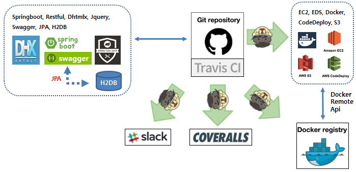
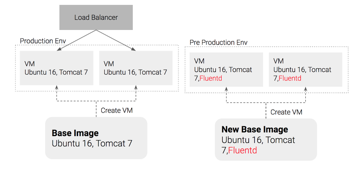
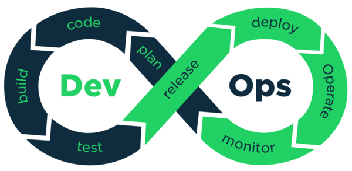

## 내멋대로 프로젝트를 시작하며

어느덧 개발경력이 10년이나된 중년 개발자가 되었다. 
나름 참 열심히 해왔다고 위안하면서도 나도 모르게 나태해지진 않았을까? 라는 의문을 가지며 이 프로젝트를 시작하게 되었다.

시작은 충동적이고 계획도 없고 목적도 없었다. 
여행을 떠나기위해 무작정 집을 나서듯 '새로운 것들을 해보자' 라는 어린아이 같은 마음으로 시작했다.

당연히 처음부터 헤매었지만 Docker, AWS, MSA, RestApi, Springboot 등등 하나하나 무작정 따라하기 시작하면서 조금은 감을 잡기 시작하였다.
AA 업무를 5년동안 수행하며 나무가 아닌 숲을 볼 수 있을정도의 안목은 있었는지 대부분의 기술을 연결하여 하나의 큰 흐름을 잡을 수 있었다.

이제부터 하나하나 프로젝트를 진행해온 과정, 기술, 격었던 어려움 등을 기록해보려한다.

거창한 목적은 없는 프로젝트이다. 어쩌면 자기만족을 위한 프로젝트랄까.

**하지만 작은 소망이 있다면 누군가 나와같은 고민을 할지 모르는 사람들에게 도움이 되었으면 한다.**

N.WMS 프로젝트는 [Presentation 프로젝트](https://github.com/cain0605/nwms.presentation)와 [Service 프로젝트](https://github.com/cain0605/nwms.service)로 구성되어 있으며 GitHub에서 소스를 확인할 수 있으며 AWS 서비스에서 사용해 볼 수도 있다.

[http://ec2-54-201-240-208.us-west-2.compute.amazonaws.com:8000](http://ec2-54-201-240-208.us-west-2.compute.amazonaws.com:8000)

[http://ec2-54-201-240-208.us-west-2.compute.amazonaws.com:8100/swagger-ui.html](http://ec2-54-201-240-208.us-west-2.compute.amazonaws.com:8100/swagger-ui.html)


## 프로젝트 진행초기 어려움

누군가 변화하고 싶다면 환경을 바꿔보라고 권해주고 싶다. 환경을 바꾸는 방법중에 새로운 사람을 만나보는것은 좋은 방법중 하나인것 같다.
내가 그랬다. 같은 회사에 오래 있다보니 맡은 일에 대해서는 자신 있었다. (참고로 내 대부분의 경력은 공공 SI에서 PL, AA, 개발자 이다).
하지만 이 테두리를 조금만 벗어나면 내가 얼마나 아는게 없는지 종종 느낀다.

진행초기 가장 어려웠던 점은 10년동안 프로젝트를 경험하며 가지게된 편견이랄까? 
오로지 내 의사결정만으로 방향이 잡아지는 자유분방한 프로젝트는 처음이라 무엇부터 해야할지 당황스러웠다. 
계획부터 수립해볼까라고 생각할때쯤 웃음이 나왔다. 왜? 누구도 안볼건데 만들필요가 없었다.

그럴때 도움이 되었던 것은 곁에 있던 친구다. 새로운 사람은 아니었지만 나의 관심사가 바뀌면서 새롭게 느껴졌다.
그 친구와 프로젝트를 공유하면서 편하게, 호기심 가득하게 내멋데로 프로젝트를 진행 할 수 있게 조금씩 변해갔다.

**당신도 변화가 필요하다면 새로운 누군가 또는 새롭게 느껴지는 누군가를 만나보아라. 새로운 일을 시작할 수 있을지도 모른다.**


## 프로젝트 기술요소



부끄러운 이야기지만 프로젝트를 구성하는 모든 기술요소는 전부 처음 해보는 것들이다. (평소 알고는 있었다하더라고 구현은 처음이다)
내가 다양한 기술에 익숙치 못한점도 있지만 일부러 내가 익숙한 기술은 전부 배제했기 때문이기도 하다.

처음엔 방향이 없었지만 하나씩 무작정 따라하다 보니 몇가지 구현해보고 싶은 방향과 키워드가 생겼다.
MicroService Architecture, DevOps, OpenSource 이다. 사실 한분야 한분야가 많은 지식과 노하우를 요구한다는건 알지만 뭐 어떤가?

**내멋대로 이런 것들을 흉내 내보기로 했다.**

- [**SpringBoot**](http://spring.io/projects/spring-boot) : 잘한다고 말은 못하지만 배운게 JAVA 라 그나마 만만했다.
- [**JPA**](https://projects.spring.io/spring-data-jpa) : Hibernate 시절부터 친구와 단골 논쟁거리였던 ORM 이다. 
나로서는 업무에 도입할 일이 없었고 복잡한 쿼리에 대응할 수 있을지 많은 의구심이 든  API 이다. 그래서인지 이럴때 과감히 써보고 싶었다.
- [**RestfulApi**](https://docs.microsoft.com/ko-kr/azure/architecture/best-practices/api-design) : 옛날부터 궁금했다. 철처히 독립된 시스템간의 의사소통방식은 어떻게 할까?
- [**Swagger**](https://swagger.io/tools/swagger-ui) : 프론트 개발자가 아니다보니 개발과정에서 매번 UI 가 걸렸다. 그런 고민을 쉽게 해결해준녀석
- [**Dhtmlx**](https://dhtmlx.com) : 그래도 명색이 프로젝트인데 UI 는 있어야지 하는 마음에 ㅠ_ㅠ 고르고 골라봤지만 부족한듯 싶다.
- [**Git**](https://github.com) : 참.. 지금까지 이걸 안써봤다는게 부끄러울 따름이다. SVN, CVS 가 아닌 첫 형상관리 도구이다.
- [**Travis**](https://travis-ci.org) : CI를 고민할때쯤 친구의 추천으로 쓰게되었는데 편하다. 당연한 이야기겠지만 GitHub 와 찰떡 궁합인듯 하다.
- [**Coveralls**](https://coveralls.io) :  아직 제대로 쓸줄은 모른다 앞으로 해볼 생각이다. 연동만 해놨다.
- [**Slack**](https://slack.com) :  예전에 잠깐 구경정도 해봤는데 써볼수록 장점이 많은것 같다.
- [**Trello**](https://trello.com) : 애자일 코스프래를 해보려했는데 혼자라 의미가 없드라. 연동만 해놓으려한다.
- [**AWS**](https://aws.amazon.com/ko) : 클라우드 흉내내기다. 사실 뭔가를 하고싶은데 개인 개발자 입장으로 가볍게 서버환경을 구성하기에는 AWS 프리티어가 짱인듯하다.
- [**Docker**](https://www.docker.com) : 호기심에 시작했지만 해보고나니 써야할 이유가 참 많은것 같다.
- Kubernetes : 운영환경 기술의 꽃이 아닐까 생각된다.

프로젝트는 개발환경에서 운영환경까지 자동배포되는 과정에서 요소요소에 기술들이 쓰여졌다. 시스템의 개발 및 운영의 효율성보다는 실습이라는 부분에 좀더 초점이 맞추어 졌다는것을 이해했으면 한다. 어차피 나도 초보다.



(위의 그림은 [해당 페이지](http://bcho.tistory.com/m/1224)에서 인용하였습니다)


## 기술습득과정

프로젝트를 구성하는 기술요소들을 하나씩 맛만 보는데 3주라는 시간이 걸렸다. 짧다면 짧고 길다면 길다. 
처음부터 목적은 한가지 기술을 깊이 파는게 아니였기에 우선 다영한 경험을 해보고 싶었다.

기술습득에서 가장 중요한 부분은 '필요성을 느끼는것' 이 아닌가 싶다. 다행이도 새로운 기술에 대해 과거에 유사한 경험을 해보았기에 왜 필요한지에 대해서는 자연스럽게 받아들여졌다. egovframwork, mybatis, svn, hunson, nexus 등등이 그런것들이다.

다만 새로운 기술환경 흔히말하는 기술생태계를 이해하는 데에는 조금 시간이 걸렸지만 공부를 하다보니 자연스레 받아들일 수 있었다.
그렇다고 해도 겨우 일부일뿐이지 python, tensorflo, jsframework 등 요즘 유행하는 기술들은 여전히 낫설다.

마음같아선 다해보고 싶지만 하다하다 지쳐서 죽도밥도 안될거같기에 이정도 선에서 진행해보려 한다.
공부하며 도움이 되었던 블러그나 자료들은 [http://cain0605.slack.com](http://cain0605.slack.com) #link 채널에 정리하고 있다.

가입은 [http://ec2-54-201-240-208.us-west-2.compute.amazonaws.com:3000](http://ec2-54-201-240-208.us-west-2.compute.amazonaws.com)

정리가 목적은 아니기에 보기에 불편 할 수도 있다.

**기술습득 단계에서는 직접해보고 필요성을 느껴보도록 노력해보아라.**



(위의 그림은 [해당 페이지](https://www.contegix.com/devops-part1-its-more-than-teams)에서 인용하였습니다)


## 왜 WMS 인가?

창고관리시스템(Warehouse Management System)이 일반인들에게 친숙한 주제는 아니다. 좀더 보편적인 주제로 프로젝트를 하고 싶었지만 딱히 떠오르는게 없었다. 아이디어가 있다면 언제나 추천받길 원한다.

공공SI 8년 솔루션개발 2년동안 경험한 개발중 재미있었지만 가장 어려웠고 그만큼 아쉬움도 많았기에 내나름데로 쉽고 범용적으로 재설계 해보고싶었다. 물론 구현한 소스처럼 단순한 시스템은 절데 아니다.

일반적으로 WMS 는 폐쇄적인(in-house 에 적합한) 시스템이다. 아직도 명확한 컨셉트는 정하지 못했지만 소상공인들이 사용가능한 형태로 개방적인 시스템으로 만들어 보려한다. UI로는 챗봇도 고민하고 있는데 잘되면 사업을 하게되지 않을까? 라는 착각을 해본다. ^^;;

아무리 내마음데로 진행하는 프로젝트라지만 되는데로 하지는 못하겠다. 그게 나의 한계일까? 일단 사업성이 있고, 확장이 용이해야하며, 지금은 파일럿이지만 제대로 서비스 할 수 있는 시스템을 만드는것이 목표이다.

**프로젝트주제는 스스로 동기부여가 될만한 아이템으로 진행해보아라**


## 프로젝트는 아직도 진행중

프로젝트를 시작한지 6주(현재 2018.06.26)정도가 지났다. 나름 열심히 한다고 했지만 본업이 있기에 그리고 새로운 기술의 습득을 겸해야 하기에 생각만큼 진도가 나가진 않는다. 프로젝트의 방향은 크게 두가지이다. 하나는 서비츠즉면의 완성도이고, 다른하나는 시스템을 운영하기위한 자동화 기반 구축이다.

지금은 서비스측면에서는 겨우 새로습득한 기술을 적용해서 샘플 수준의 프로그래밍이 되어있으며, 운영환경 역시 그러하다.

향후 계속 진행하면서 학습수준이 아닌 실무수준의 프로그래밍과 운영환경을 구축해 볼생각이다.


```markdown
```
